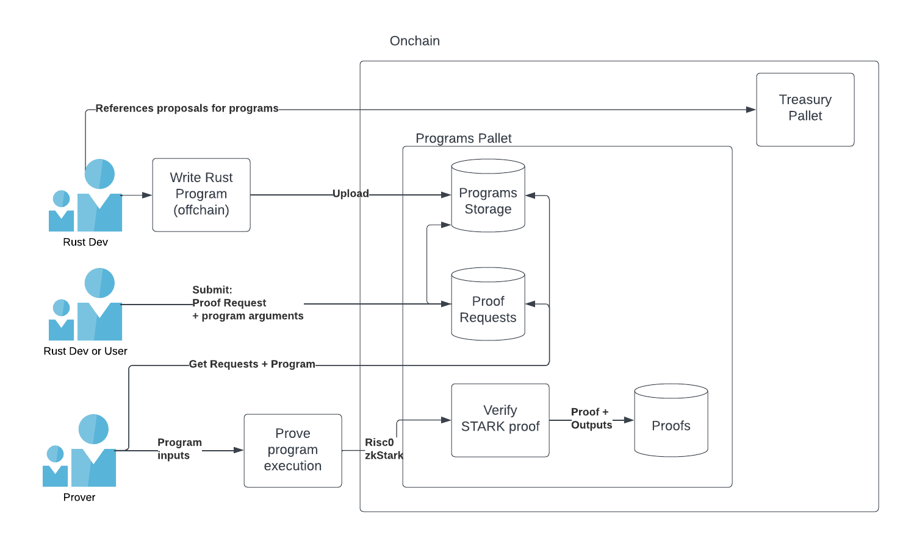

# Substrate TOEP
    T - Trustless
    O - Offchain
    E - Executable
    P - Programs

ZK-provable Offchain Programs

Project which features onchain tracking of offchain Rust programs and their execution, which is proven using Risc0 and whose zkSTARK proofs are verified onchain.

## Key Features
- Trustless Verifiable Offchain Computation
- zk-STARK proven execution
- Write zk-proven programs in plain Rust
- Privacy-preserving
- zk prover infrastructure, incentivised through proof market
- (Future) Composability of proofs/programs with recursive proofs 🤯




## Project Structure
```
├── node: contains all code for Substrate chain
│   ├── pallets
│   │   ├── prover-mgmt: custom pallet for proof verification, program storage, and proof market
│   ├── runtime
│   ├── node
├── examples: Contains code for example program
│   ├── factors: CLI for building and uploading "Factors" example program
│   ├── methods: Core logic for example program
├── prover: Prover application for proving one program execution and uploading its proof onchain
```

### Prover
This component is for network participants who wish to provide proving functionality for programs, which earns them rewards. Provers identify programs uploaded to the chain which have also received a request for proof.

Anyone can operate this component. This is a CLI application which requests some `image_id` that represents an onchain program. If the program is received, the prover begins a session for the program and proves its execution, outputting a STARK proof. This proof is then uploaded. verified onchain in the pallet, and stored.

### Examples
Examples demonstrating how to write an offchain program are included in `./examples`. The current example also uploads the program to the chain, and requests a proof for it.

## Usage instructions
This walks through an example workflow which consists of:
1. A program developer writes their program and uploads it to the chain
2. The program developer also submits a request for a proof to be generated for their program
3. A prover notes the request, starts the proving process, generates the proof, and submits it to the chain, fulfilling the request.

### Start the chain
Start the chain by building the code `cargo build --release`, and starting the node: `./target/release/node-template --dev`.

### Upload program
See `./examples` for an example of a provable program. To test uploading the program to the chain, run:
```cargo run```
from `./examples/prover`
It will return the `image id`, which is handy for proving later

### Prover
Prover nodes can fulfill onchain requests for proofs. The included proving cli application in `./prover` allows someone to pass an `image_id` of an onchain program, retrieve it, prove it, and upload the resulting proof to fulfill the request. To test, pass a hex-encoded, bincode-serialized image id(just copy the output from the `./examples` local execution)
```
cargo run -- --image-id {your image id}

### Use through docker image
`docker run -dit --net=host docker.io/library/tope`

